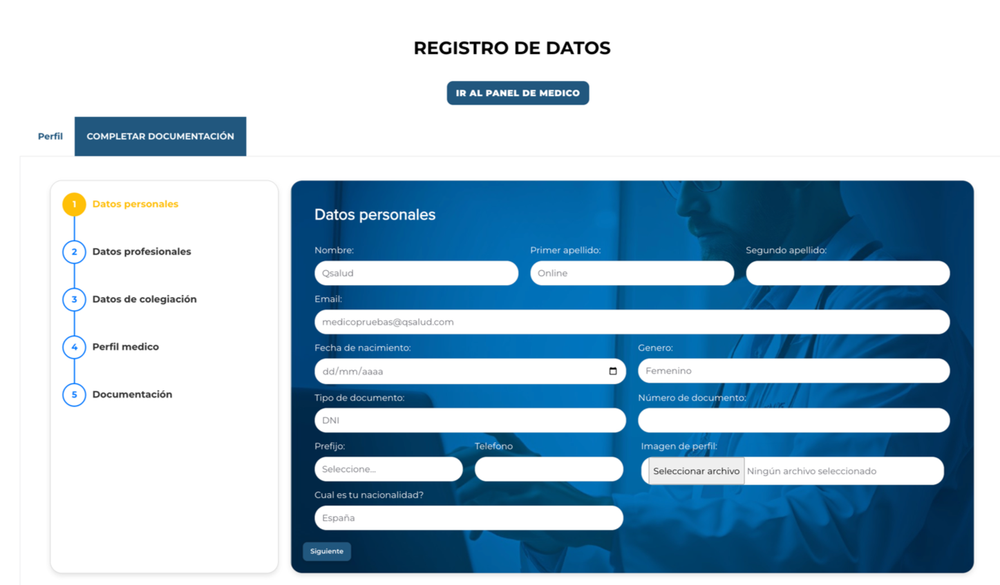
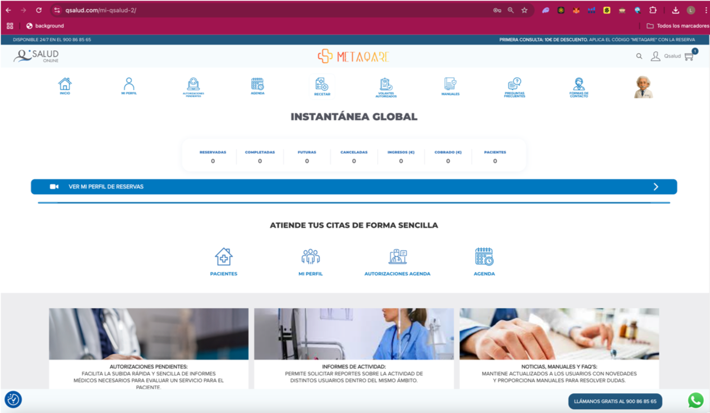
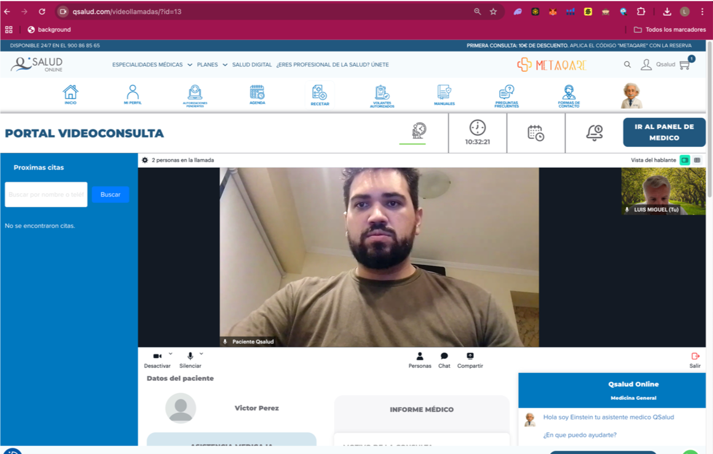
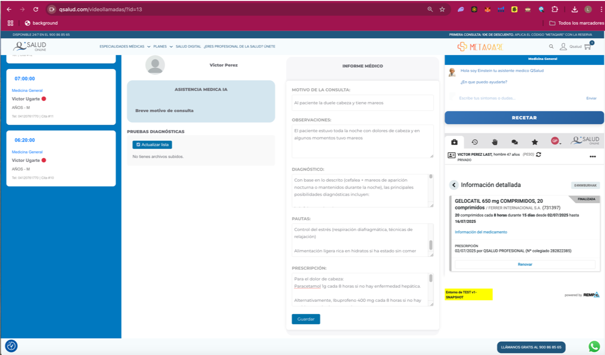
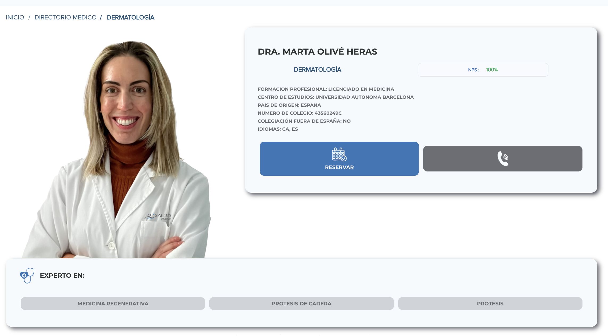
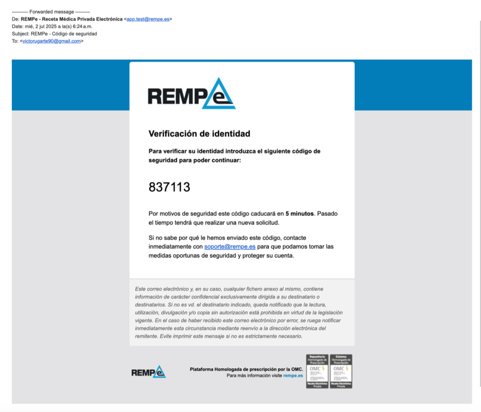

# Manual del Profesional Médico | MetaQare

Este manual proporciona a los profesionales médicos una guía práctica y estratégica para utilizar MetaQare como plataforma clínica centralizada. Diseñado para médicos que operan en el entorno digital (ya sea en red Qsalud o integrados desde aseguradoras), este ecosistema combina agilidad, trazabilidad clínica y eficiencia operativa a través de IA, blockchain y videomedicina.
...

## Acceso e Inicio de Sesión

•	Acceso desde: https://qsalud.com o URL institucional personalizada 

•	Inicio de sesión mediante email o cuenta federada (Google/Facebook)

•	Sistema de autenticación de doble factor (2FA) para firma de recetas y documentos

...

## Configuración de Perfil Médico

Una vez dentro del sistema, el médico puede configurar:

•	Datos personales y profesionales

•	Número de colegiado, especialidad y subespecialidades

•	Documentación obligatoria: seguro de responsabilidad civil, certificados

•	Idiomas, disponibilidad horaria y preferencias de consulta

MetaQare garantiza que solo médicos habilitados y colegiados acceden a la funcionalidad clínica avanzada.

...

## Gestión de Agenda y Disponibilidad

Desde el panel de configuración:

•	Definición de horarios semanales y excepciones (festivos, bloqueos)

•	Personalización por modalidad: videollamada, telefónica o chat

•	Activación o desactivación de fechas especiales

El sistema sincroniza la agenda automáticamente con las citas agendadas desde el portal del paciente o desde aseguradoras integradas.

...

## Panel de Control Médico

Desde el panel principal, el profesional accede a:

•	Visión general de todas las consultas (hoy, semana, mes)

•	Estado de cada consulta: completada, cancelada, pendiente, no presentada

•	Ingresos generados y pagos procesados (segmentados por compañía o canal)

•	Estadísticas personales (NPS, tiempo medio de consulta, especialidades más frecuentes)

“El 65% de los médicos en Europa consideran que su sistema actual digital está fragmentado y poco eficiente” — McKinsey Health Systems Report, 2023

...

## Portal de Videoconsulta

Cada consulta se ejecuta desde un entorno clínico virtual con:

•	Chat médico/paciente y posibilidad de chat interno (coordinadores, especialistas)

•	Videollamada encriptada con opción de compartir documentos en tiempo real

•	Acceso inmediato a la historia clínica del paciente

•	Generación automática del informe clínico (editable)

•	Posibilidad de transferir la consulta o escalar a segundo nivel

MetaQare incorpora un Asistente IA Clínico que:

•	Resume automáticamente historias clínicas largas

•	Sugiere alertas clínicas o contraindicaciones

•	Propone tratamientos estándar validados

...

## Prescripción y Receta Electrónica (REMPE)

•	Receta electrónica homologada para prescripción inmediata

•	Integración con REMPE (plataforma nacional de receta electrónica privada)

•	Envío automático al paciente tras la firma digital

•	Generación de hoja de medicación activa en PDF

•	Firma electrónica avanzada eIDAS

“La automatización de la receta médica reduce en un 60% los errores de transcripción y mejora la adherencia terapéutica” — Deloitte eHealth Europe, 2024

...

## Informes Médicos Inteligentes

•	Plantilla configurable por especialidad 

•	Prellenado automático con IA generativa (editable por el médico) 

•	Firma y archivo en el historial clínico 

•	Descarga inmediata por el paciente 

...

## Gestión de Ingresos y Remuneración

Cada médico dispone de un espacio donde: 

•	Se visualizan sus ingresos por acto médico, compañía y mes 

•	Se consulta el estado de pagos (abonado, pendiente, programado) 

•	Puede descargar justificantes para IRPF y autónomos

Para médicos en red Qsalud, el sistema muestra también:

•	Citas asignadas automáticamente

•	Ingresos variables por rendimiento (KPI) 

...

## Indicadores de Desempeño Profesional (KPI)

•	NPS promedio mensual (valoración paciente) 

•	Tiempo medio por consulta 

•	% de resolución sin derivación 

•	% de seguimiento programado 

•	Ratio de asistencia efectiva vs ausencias 

...

## Seguridad y Buenas Prácticas Clínicas

•	Firma electrónica solo habilitada con número verificado 

•	Acceso restringido a médicos con documentación validada 

•	Historial clínico trazable, con logs firmados 

•	Consentimientos automáticos registrados por paciente 

...

## Soporte y Formación Continua
•	Guías interactivas dentro del portal 

•	Canal de soporte 24h para incidencias técnicas o clínicas 

•	Webinars mensuales con actualización clínica y normativa 

•	Acceso a equipo médico coordinador para resolución de casos

...

MetaQare ofrece al médico digital un entorno clínico único, eficiente y trazable. Porque el futuro de la medicina empieza con herramientas a la altura del profesional.
