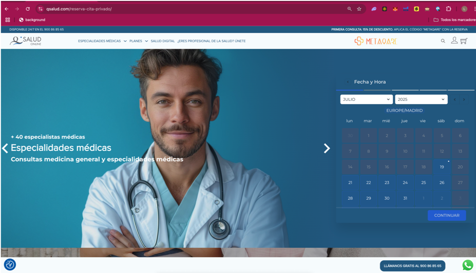

## Manual del Paciente / Asegurado | MetaQare

El presente manual tiene como objetivo ofrecer una guía detallada, estratégica y pedagógica sobre cómo un paciente o asegurado puede navegar, beneficiarse y sacar el máximo provecho de la infraestructura digital MetaQare, desplegada en aplicaciones como Qsalud. MetaQare no es una app más: es un ecosistema diseñado desde la evidencia clínica, los datos, y la tecnología de vanguardia para que el paciente recupere el control de su salud con autonomía, seguridad y acompañamiento profesional.

## Acceso al Ecosistema MetaQare

MetaQare está diseñado para ofrecer accesibilidad desde cualquier entorno y dispositivo. El acceso se realiza principalmente desde:

•	Portal web: https://qsalud.com

•	Dispositivos móviles (web responsive)

•	Enlaces directos desde aseguradoras colaboradoras (ej. MAPFRE Salud)

Una vez dentro del sistema, el usuario podrá elegir entre navegar por su cuenta o dejarse guiar por el Asistente Inteligente de Triaje, que constituye uno de los pilares tecnológicos diferenciales del ecosistema.

"El 70% de los usuarios en Europa esperan una experiencia digital fluida y comparable a la de Amazon o Netflix, también en salud." — McKinsey HealthTech Survey 2023

...

## Triaje Inteligente y Personalización del Servicio

Una de las innovaciones diferenciales de MetaQare es la automatización del triaje clínico mediante IA. Este agente IA:

•	Formula preguntas adaptadas a los síntomas descritos.

•	Evalúa nivel de urgencia y necesidad de derivación.

•	Sugiere la especialidad médica más adecuada.

•	Recomienda canal de atención (videollamada, llamada, mensajería).

•	Prioriza disponibilidad según urgencia y preferencias horarias.

Este enfoque permite reducir tiempos de espera, mejorar la asignación de recursos y aumentar la satisfacción del paciente desde el primer minuto.

“Los asistentes IA permiten ahorrar hasta un 35% del tiempo total en la experiencia de primera atención médica.” — HIMSS Digital Care Report, 2024

 
...

## Selección de Consulta y Profesional

Los pacientes que prefieren una navegación directa pueden:

•	Elegir entre modalidad privada, aseguradora o empresarial.

•	Seleccionar la especialidad entre más de 30 disponibles.

•	Filtrar por profesional médico (nombre, sexo, idioma, valoraciones).

•	Indicar si desean el primer disponible o agendar con antelación.

En modelos como Qsalud, se permite además la reserva de múltiples consultas en un solo flujo, lo cual es especialmente útil en contextos familiares o pacientes crónicos.

...

## Agendamiento Multicanal

La experiencia de calendario es intuitiva y multicanal:

•	Interfaz con calendario personalizable.

•	Confirmación por email, SMS o WhatsApp.

•	Enlace directo a Google Calendar para integración personal.

El sistema también gestiona automáticamente:

•	Recordatorios 24h antes de la cita.

•	Posibilidad de reprogramación sin penalización.

“Una agenda médica con recordatorios automáticos reduce en un 41% la tasa de ausencias médicas (no-shows).” — Harvard Business Review, 2022

...

## Proceso de Pago Seguro

En consultas privadas, MetaQare integra pasarelas seguras (Redsys, Stripe) con validación bancaria europea.

•	Visualización anticipada de precios y duración estimada.

•	Pago por tarjeta sin comisiones ocultas.

•	Recepción inmediata de:

o	Factura fiscal

o	Acceso a la plataforma del paciente

o	Confirmación de cita por email/WhatsApp

Para pacientes asegurados, el sistema valida automáticamente la cobertura con SEOGA o API propia.
![Pagina Home QSalud]assets/pago-consulta.png)

...

## Área Personal del Paciente

El área privada del paciente está diseñada con enfoque en usabilidad y autonomía:

•	Historial de citas pasadas y próximas.

•	Informes clínicos descargables.

•	Recetas médicas activas.

•	Comunicación asincrónica con el profesional.

•	Visualización de contenidos educativos y consejos.

•	Asistente IA accesible 24/7.

Cada paciente tiene control total sobre su información, cumpliendo los principios de autodeterminación sanitaria (Ley 41/2002 y RGPD).

...

## Videoconsulta Avanzada

MetaQare permite acceder desde cualquier navegador moderno o dispositivo móvil sin necesidad de instalar apps.

Características:

•	Videollamada médica cifrada

•	Chat clínico y de soporte

•	Fondos personalizables

•	Compartición de documentos e imágenes

•	Control de calidad de audio y video previo

“El 94% de los usuarios de salud digital en España consideran esencial que la videollamada esté cifrada de extremo a extremo.” — FENIN, 2023

...

## Informes e Historial Clínico

Tras cada consulta, el sistema genera un informe médico estándar que:

•	Resume el motivo de consulta, diagnóstico y tratamiento

•	Puede incluir recomendaciones, alertas, y seguimiento

•	Está disponible en PDF para descarga inmediata

Se conserva bajo protección legal durante el plazo estipulado en normativa europea y autonómica.

...

## Receta Electrónica y REMPE

MetaQare está homologado para emitir recetas electrónicas a través de la red REMPE (Receta Electrónica Privada de España).

El proceso es:

1.	El médico prescribe desde la plataforma.

2.	El paciente recibe notificación.

3.	Acude a la farmacia con su DNI o código QR.

4.	El farmacéutico accede automáticamente a la medicación activa.

Incluye hoja de información terapéutica, trazabilidad y derechos de acceso.

...

## Asistente Médico IA 24/7

El paciente puede activar el asistente en cualquier momento para:

•	Resolver dudas frecuentes

•	Obtener explicaciones de síntomas comunes

•	Solicitar consejo de especialidad

•	Acceder a enlaces de contenido avalado

Además, el sistema puede alertar automáticamente de síntomas compatibles con urgencias y ofrecer derivación directa.

...

## Validación con Aseguradoras

Cuando el usuario selecciona una aseguradora:

•	Se solicitan los datos del asegurado.

•	El sistema consulta en tiempo real la cobertura.

•	Se filtran las especialidades disponibles.

•	El profesional recibe la validación ya hecha antes de iniciar la consulta.

Esto elimina el 100% del papeleo para el paciente.

...

## Privacidad y Seguridad

•	Encriptación AES-256 en tránsito y reposo.

•	Firma electrónica avanzada eIDAS.

•	Control de logs, acceso, y consentimiento informado automático.

•	Infraestructura sobre AWS Europa con redundancia geográfica.

MetaQare cumple con ENS, RGPD, LOPDGDD y está auditado externamente.

...

## Soporte Integral

•	Línea 24/7 para soporte técnico y médico: 900 868 565

•	Email institucional: info@qsalud.com

•	WhatsApp de soporte (pacientes): +34 696 938 675

________________________________________
MetaQare pone al paciente en el centro del ecosistema digital. Porque la salud conectada no es el futuro: es el presente. Seguro. Inteligente. Universal.

...
